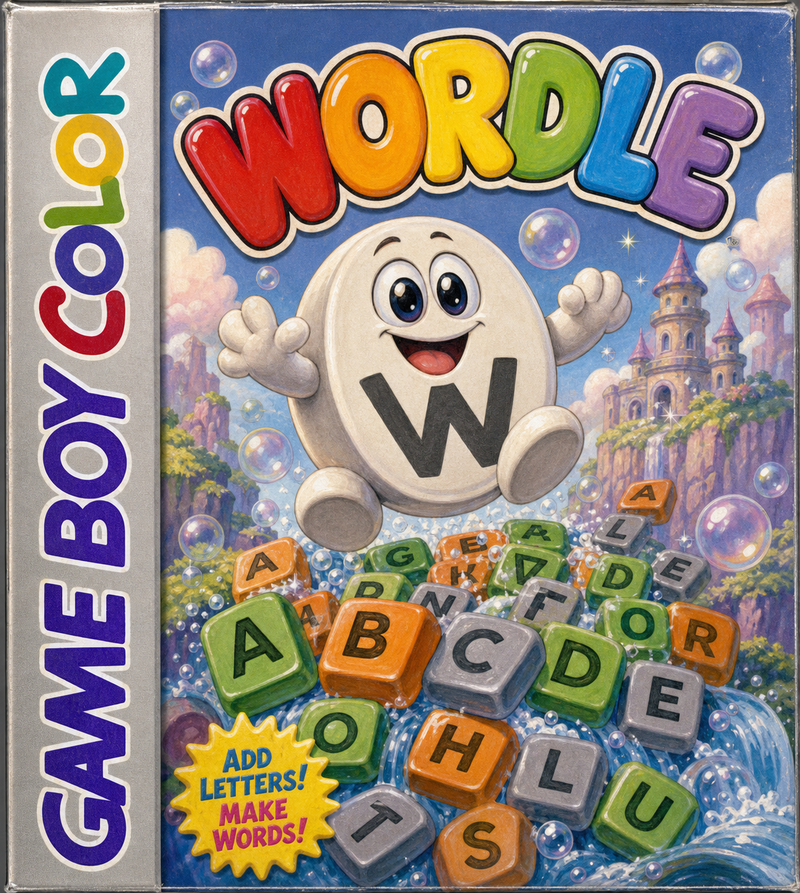
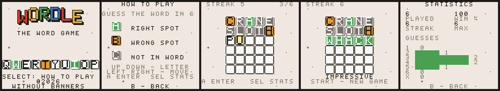

# Wordle GB

Wordle as a Game Boy Color ROM, built for the **Miyoo Mini Plus** but valid on
any GBC emulator, flashcart, or real hardware.

<p align="center">
  
</p>



Six guesses, green for the right letter in the right place, orange for the
right letter in the wrong place. The full 12,972-word Wordle guess list is in
the ROM, so a word is either real or it is not — no shortcuts.

---

## Install on a Miyoo Mini / Mini Plus

1. Download `wordle.gbc` from
   [Releases](../../releases), or grab the whole `wordle-gb.zip`.
2. Copy it to `Roms/GBC/` on the SD card.
3. If it does not appear in the menu, delete `Roms/GBC/GBC_cache6.db` — OnionOS
   rebuilds the cache on next boot.

It runs on the stock gambatte core. Nothing else to install.

> **Exit through the menu rather than pulling power.** Your statistics live in
> battery-backed cartridge RAM, which the emulator writes out when the game
> exits cleanly.

Also works in mGBA, SameBoy, BGB, RetroArch, or on a real Game Boy Color via
flashcart.

---

## Controls

There is no keyboard, so **each box is a letter dial**.

| Button | Action |
|--------|--------|
| **Up / Down** | Cycle the current box through A–Z — **hold to scroll fast** |
| **Left / Right** | Move between boxes |
| **A** | Submit the guess |
| **B** | Clear the current box |
| **Select** | Statistics (in game) / How to play (on the title) |
| **Start** | New game (once a game has ended) |

Holding Up or Down is the difference between this being pleasant and being
tedious — it auto-repeats after about a third of a second.

---

## What makes this clone different: the word list

Most Wordle clones ship a dictionary. This one ships **the game**.

The 2,315-word **answer list is the curated one the original game used** —
everyday words a person can actually arrive at, not whatever five-letter
strings a dictionary happens to contain. That curation is most of what made
Wordle feel fair: the answer is always a word you know. Clones that draw
answers from a full dictionary will eventually ask you to guess `XYLYL`, and
at that point it is a different, worse game.

The **12,972-word guess list** is the original's too, so anything you would
try in the real game is accepted here, and anything fake shakes the board
without costing a turn.

## What else is in it

- **A letter dial, not an on-screen keyboard.** Up/Down spins the letter in
  place, Left/Right moves between boxes — combination-lock entry built for a
  d-pad, with hold-to-repeat.
- **Correct duplicate-letter scoring.** `ALLOT` against `CELLO` marks one L green
  and one yellow, not two greens — the case most clones get wrong.
- **Persistent statistics.** Games played, win rate, current and maximum streak,
  and a guess-distribution histogram, all in battery-backed save RAM.
- **A how-to-play screen** — SELECT on the title shows the colour key as real
  scored tiles, so the game explains itself on the handheld.
- **Sound.** A chiptune title theme, plus small register-driven effects: the
  dial ticks, the reveal chimes across the row, rejected words buzz with the
  shake, wins get a rising sweep.
- **Newsprint look.** Warm paper ground, keycap tiles with drop shadows, and
  the NYT scoring colours — Wordle is a newspaper puzzle, and the screen
  reads like one.

---

## Building from source

Requires [GBDK-2020](https://github.com/gbdk-2020/gbdk-2020) and Python 3.

```sh
git clone https://github.com/dragontpe/wordle-gb.git
cd wordle-gb
make                    # -> build/wordle.gbc
```

Set `GBDK_HOME` at the top of the `Makefile` if GBDK is not at `~/gbdk/`.

No RGBDS toolchain is needed — hUGEDriver is vendored as a prebuilt GBDK
library, and the converted song is checked in.

### Tests

The whole game plays itself in a few seconds under
[PyBoy](https://github.com/Baekalfen/PyBoy) (`pip install pyboy`):

```sh
python3 tools/test_logic.py   # word data + scoring rules
python3 tools/test_rom.py     # boots and plays the ROM, reads the tilemap back
python3 tools/test_save.py    # statistics survive a power cycle
python3 tools/test_audio.py   # title music plays, board is silent
make preview                  # render mockups from the tile data
```

`test_rom.py` drives the d-pad like a player and reads the hardware background
tilemap to confirm which letters are on the board, so redraw and palette bugs
are caught rather than assumed away.

### Layout

```
src/            game loop, rendering, word lookup, save data
tools/          word packer, tile generator, preview renderer, test suite
audio/          .uge source music, converted song.c, licence notes
vendor/huge/    hUGEDriver prebuilt GBDK library
res/            generated at build time — not checked in
```

Tiles and word data are generated by Python scripts rather than hand-authored;
`make` runs them. Letter tiles are shared across all four states and coloured at
runtime with per-tile CGB palettes, which is what keeps the tile count down.

---

## Credits and licences

**Code** — MIT, see [LICENSE](LICENSE).

**Music** — *"Seaside Village"* by [Beatscribe](https://github.com/Beatscribe/homebrew_vgm),
released under **CC0**. Attribution is not required; it is offered anyway.

**Sound driver** — [hUGEDriver](https://github.com/SuperDisk/hUGEDriver) by
SuperDisk, public domain.

**Word lists** — the original Wordle guess and answer lists, as published in
[these](https://gist.github.com/cfreshman/cdcdf777450c5b5301e439061d29694c)
[gists](https://gist.github.com/cfreshman/a03ef2cba789d8cf00c08f767e0fad7b).

Wordle was created by Josh Wardle and is owned by The New York Times Company.
This is an unaffiliated fan project, not endorsed by or connected to them, and
is given away free.

### A note on the word list

The classic guess list is not filtered for offensive words — it contains a
number of slurs and assorted profanity, exactly as the original game's guess
list does. The New York Times curated the *answer* list, not the list of words
you are allowed to type. If you would rather strip them, filter in
`tools/pack_words.py` before packing; nothing else in the pipeline changes.
